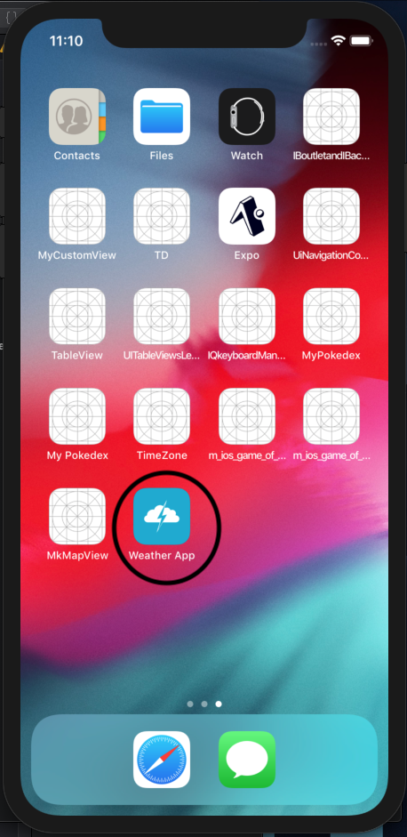
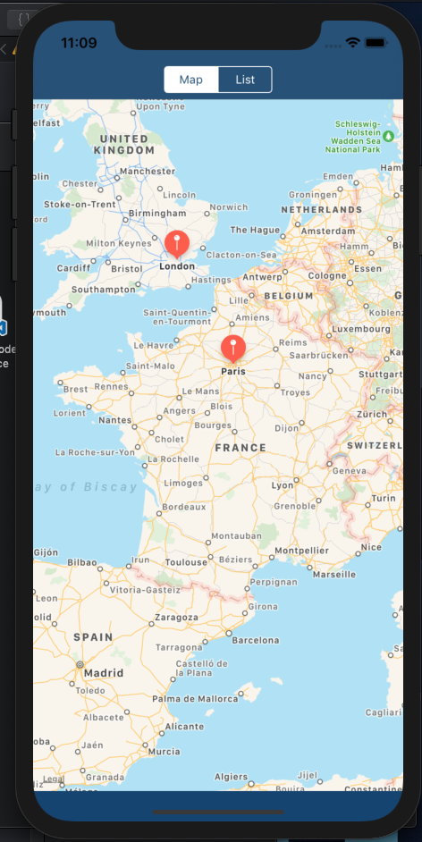
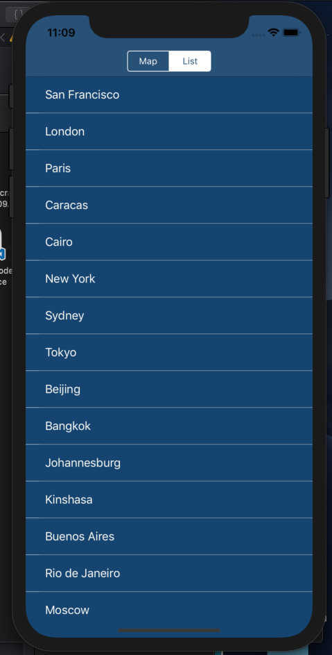
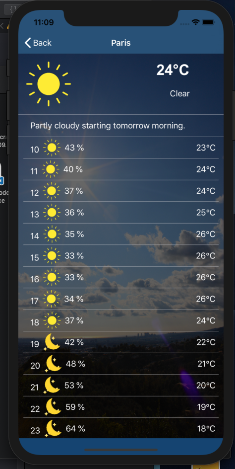
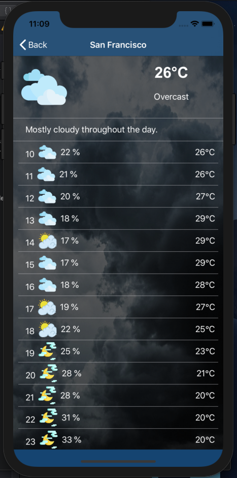

# :round_pushpin: Weather App :earth_africa:
 
Developed in Swift.
## Description

This app is used to see the weather, when you start the app, you can see a map with different locations, you can asso access to them with the menu. When you tap on a location, you can see the weather.

## Used Pods

This app use:
 - Alamofire

## Used API

This app use:
- DarkSky: https://darksky.net/

## Version

v1.0.0

## Screen APP

    APP ICON

    Screen MAP

    Screen List

    Weather City 

